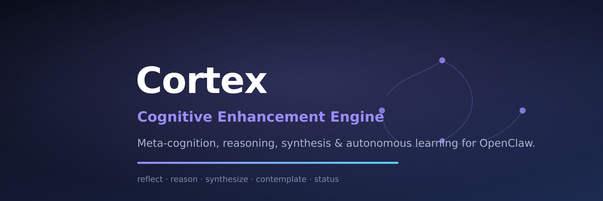

<div align="center">



# 🧠 Cortex — Cognitive Enhancement Engine

**Meta-cognition, self-reflection, reasoning, knowledge synthesis, and an autonomous learning loop for OpenClaw agents.**

[](LICENSE)
[](https://openclaw.ai)
[](https://clawhub.ai)

[What it does](#what-it-does) ·
[Why it exists](#why-it-exists) ·
[Tools](#tools) ·
[CLI](#cli) ·
[Install](#install) ·
[Configuration](#configuration) ·
[Repo layout](#repo-layout) ·
[Local dev](#local-development) ·
[Notes](#notes)

</div>

---

## What it does

`cortex` turns OpenClaw from a reactive assistant into a **self-aware cognitive
system**. It reflects on its own outputs, builds structured reasoning chains,
synthesizes conflicting sources, contemplates hard questions through multiple
passes, and tracks a live "cognitive health" dashboard — plus a background
learning loop that extracts a knowledge graph and watches for drift.

Five tools ship in the box:

| Tool | What it does |
|------|--------------|
| `cortex_reflect` | Structured self-reflection on a thought/response — critiques accuracy, completeness, bias; returns a revised version. |
| `cortex_reason` | Builds a reasoning chain, detects logical fallacies, scores confidence. Modes: `fast` / `deep` / `adaptive`. |
| `cortex_synthesize` | Merges multiple sources into one insight; flags conflicts and knowledge gaps. |
| `cortex_contemplate` | Multi-pass inquiry (explore → reflect → synthesize) for strategic/ambiguous questions. |
| `cortex_status` | Live cognitive dashboard: entropy level, drift, knowledge-graph stats, health. |

## Why it exists

A raw model answers. A *thinking* system checks its own work. Cortex adds the
meta-layer: catch flawed reasoning before it ships, spot when a conversation
drifts, and accumulate structured knowledge across sessions.

## Tools

All tools read config defaults (reflection depth, reasoning mode, entropy
threshold) and accept overrides per call. Example agent usage:

```text
cortex_reflect(thought="Our Q3 plan...", depth=3)
cortex_reason(query="Should we migrate to Postgres?", mode="deep")
cortex_synthesize(sources=["<doc A>", "<doc B>"])
cortex_contemplate(inquiry="What is the right balance between speed and safety?")
cortex_status()
```

## CLI

```bash
openclaw cortex-status     # cognitive health snapshot
openclaw cortex-graph <entity> [--depth N]   # query the knowledge graph
openclaw cortex-reset      # reset cognitive state
```

## Install

From ClawHub:

```bash
clawhub package install @pmuhammadagus-byte/openclaw-cortex
```

From source:

```bash
cd openclaw-cortex
npm install
node ./node_modules/typescript/bin/tsc
openclaw plugins install .
```

## Configuration

| Key | Type | Default | Description |
|-----|------|---------|-------------|
| `reflectionDepth` | integer (1–3) | `2` | Reflection passes. |
| `reasoningMode` | `fast` \| `deep` \| `adaptive` | `adaptive` | Default reasoning mode. |
| `entropyThreshold` | number (0–1) | `0.7` | Drift detection sensitivity. |
| `autoContemplate` | boolean | `true` | Auto-contemplate complex queries. |
| `knowledgeGraphEnabled` | boolean | `true` | Entity extraction + knowledge graph. |
| `memoryDir` | string | `""` | Cognitive memory storage directory. |

## Repo layout

```
openclaw-cortex/
├── assets/            banner.svg / banner.png
├── src/
│   ├── index.ts       plugin entry (definePluginEntry)
│   ├── cognition/     reflect · reason · synthesis · contemplation
│   ├── memory/        entropy · knowledge-graph
│   ├── hooks/         lifecycle hooks (monitoring)
│   ├── commands/      CLI (Commander)
│   └── utils/         types
├── dist/              compiled output
├── openclaw.plugin.json
├── package.json
├── tsconfig.json
├── LICENSE
└── CONTRIBUTING.md
```

## Local development

```bash
npm install
node ./node_modules/typescript/bin/tsc    # must exit 0
clawhub package inspect .                 # verify before publish
clawhub package validate .                 # must report 0 breakages
```

## Notes

- **Rebuilt for OpenClaw 2026.7.1** using the modern `definePluginEntry` SDK.
  Hooks use the public `InternalHookEvent` API (named, `void`-returning); the
  legacy `before_agent_finalize` revise / `before_prompt_build` prepend hooks
  are not supported by the current public API, so Cortex runs them as
  **observational monitoring** (entropy tracking + knowledge extraction) and
  surfaces cognition through its tools and CLI.
- **Privacy:** cortical state is local. No data leaves the machine unless you
  explicitly share it.

---

<div align="center">

Made with 🧠 by **Clara** for **Bos** · MIT Licensed

</div>
